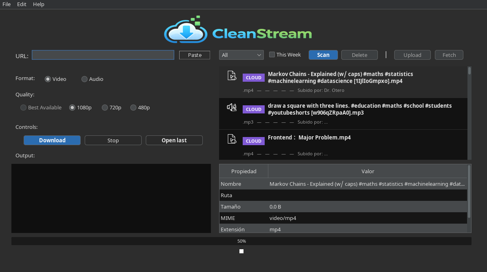

# CleanStream

Desktop media manager built with Java Swing, focused on local media downloads, library management and synchronization with a remote media API.

<p align="center">
  
</p>

## Overview

CleanStream is a Java desktop application that combines local media management with remote synchronization.

The application can download and process media through `yt-dlp` and FFmpeg, manage a local library, authenticate against a REST API and synchronize media information with a remote service.

The project was built with an emphasis on separating UI, application logic and external integrations rather than keeping the entire Swing application inside a single window class.

## Features

- Download media using `yt-dlp`
- Audio and video processing through FFmpeg / ffprobe
- Local media library management
- REST API integration
- JWT-based authentication
- Optional remembered session and automatic login
- Upload and synchronization with remote media storage
- Background operations without blocking the Swing Event Dispatch Thread
- Configurable application preferences
- Automatic polling for remote media updates
- Dark desktop interface built with Swing and FlatLaf

## Architecture

The project is organized into several application layers:

```text
src/main/java/cat/dam/roig/cleanstream
├── app          Application entry point
├── config       Application configuration
├── controller   UI orchestration and application flow
├── domain       Domain models and application state
├── services
│   ├── auth     Authentication and session management
│   ├── cloud    Remote media integration
│   ├── polling  Remote update polling and events
│   ├── prefs    User preferences
│   └── scan     Local media scanning
├── ui           Swing panels, dialogs and renderers
└── util         Shared utilities
```

The goal of this structure is to keep UI responsibilities separated from application logic and external-service communication.

## Technical Highlights

### Asynchronous UI operations

Potentially slow operations are executed outside the Swing Event Dispatch Thread so that downloads, scans and network operations do not freeze the interface.

### Authentication and session persistence

Authentication logic is isolated in a dedicated service responsible for:

- API login
- JWT token handling
- session persistence using Java Preferences
- optional remembered email
- automatic session restoration
- logout and authentication-state cleanup

### Remote media polling

CleanStream uses an event-based polling abstraction to detect remote media updates and propagate them to the application without tightly coupling the remote API component to the UI.

### External tool integration

Media operations are delegated to established command-line tools:

- `yt-dlp`
- `ffmpeg`
- `ffprobe`

The application coordinates these processes from Java and integrates their results into the desktop workflow.

## Tech Stack

| Area | Technology |
|---|---|
| Language | Java 24 |
| Desktop UI | Java Swing |
| UI theme | FlatLaf |
| Build tool | Maven |
| HTTP | `java.net.http.HttpClient` |
| JSON | Jackson |
| Authentication | JWT |
| Persistence | Java Preferences |
| Media download | yt-dlp |
| Media processing | FFmpeg / ffprobe |
| Concurrency | SwingWorker / Swing event model |

## Project Structure

```text
cleanstream
├── src/
│   └── main/
│       ├── java/
│       └── resources/
├── installer-assets/
├── manual/
├── pom.xml
├── .gitignore
└── README.md
```

## Requirements

- JDK 24
- Maven
- yt-dlp
- FFmpeg / ffprobe
- MediaPolling component used by CleanStream

> A reproducible clean-build setup is still being reviewed because the MediaPolling dependency is currently managed as a separate local Maven project.

## Current Status

The core desktop application is functional and includes local media handling, authentication, remote synchronization and polling.

Some usability improvements remain open, including automatic discovery of the `yt-dlp` executable and improvements to the preferences workflow.

See the repository Issues section for the current backlog.

## What I Learned

This project gave me practical experience with:

- structuring a medium-sized Java application
- separating controllers, services, domain objects and UI
- consuming REST APIs from Java
- managing JWT-based sessions
- asynchronous work in Swing applications
- integrating Java applications with external CLI processes
- designing event-based communication between components
- managing a Maven-based project with Git and GitHub

## Background

CleanStream originated as a project developed during the **Higher Vocational Training in Multiplatform Application Development (DAM)**.

It was progressively expanded across several course assignments into a larger desktop application, with additional work on architecture, API integration, concurrency and user experience.

---

**Elias Roig**  
Junior Java Developer · Backend-focused
